# AWS Identity and Access Management
## IAM a user dashboard
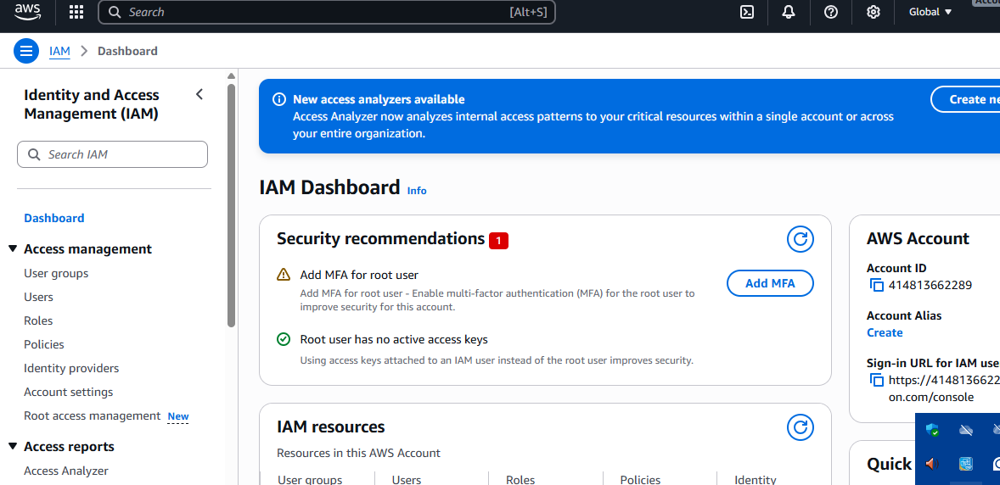
## Creating Policy for developers and analyst
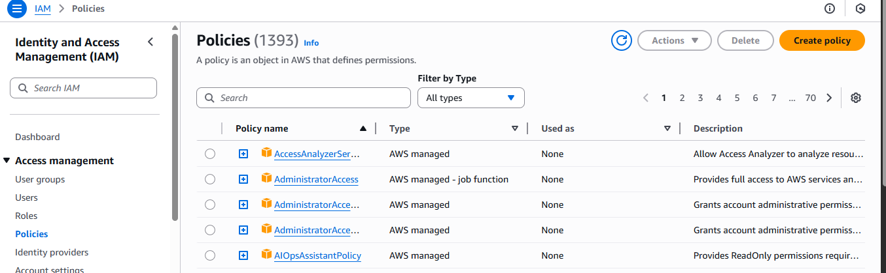
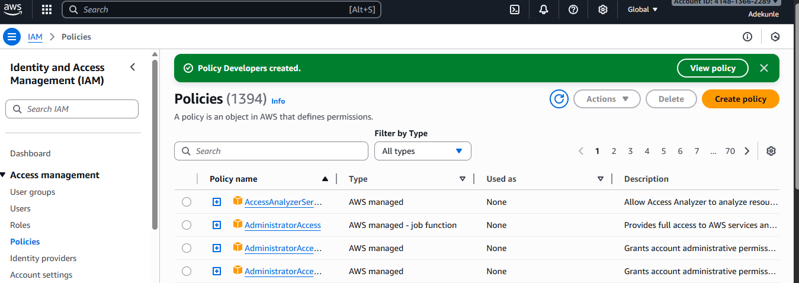
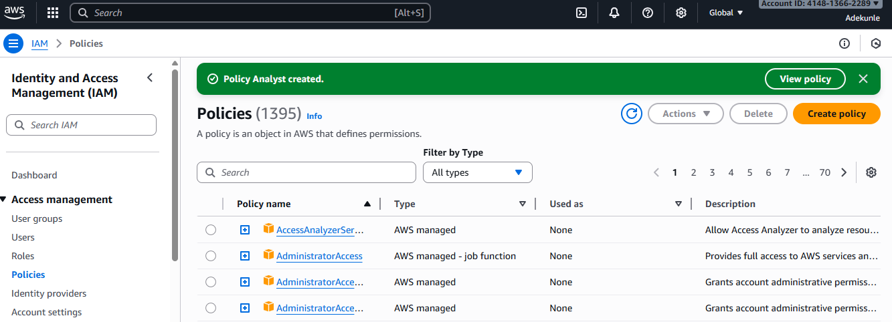
## User Group for Development Team and Analyst Team
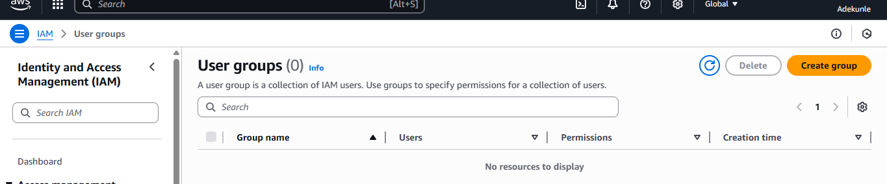
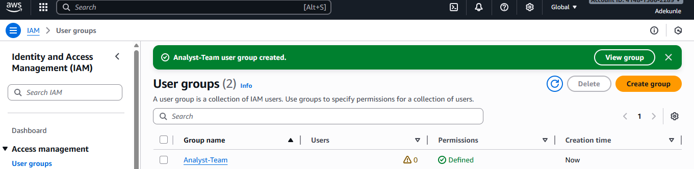
## Creating IAM user john and mary
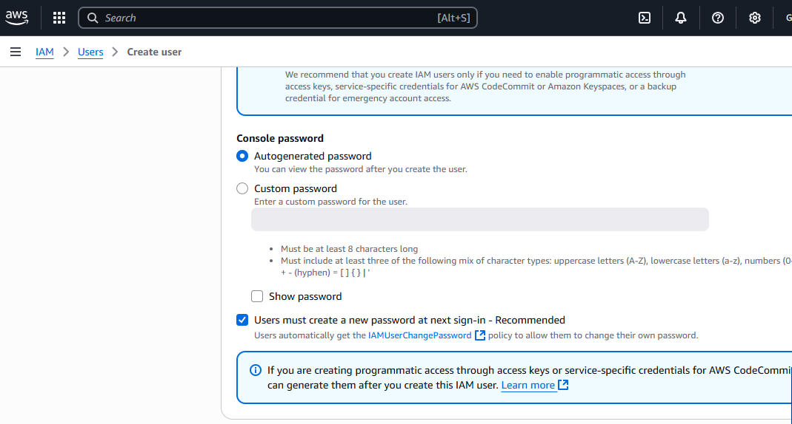
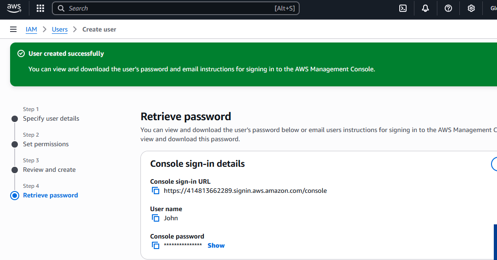
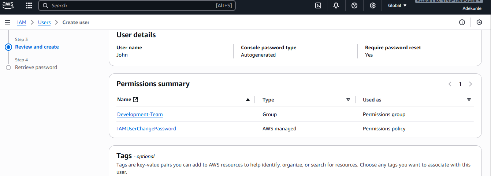
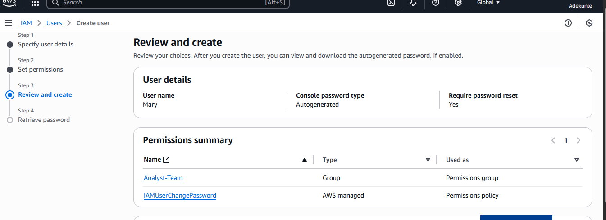
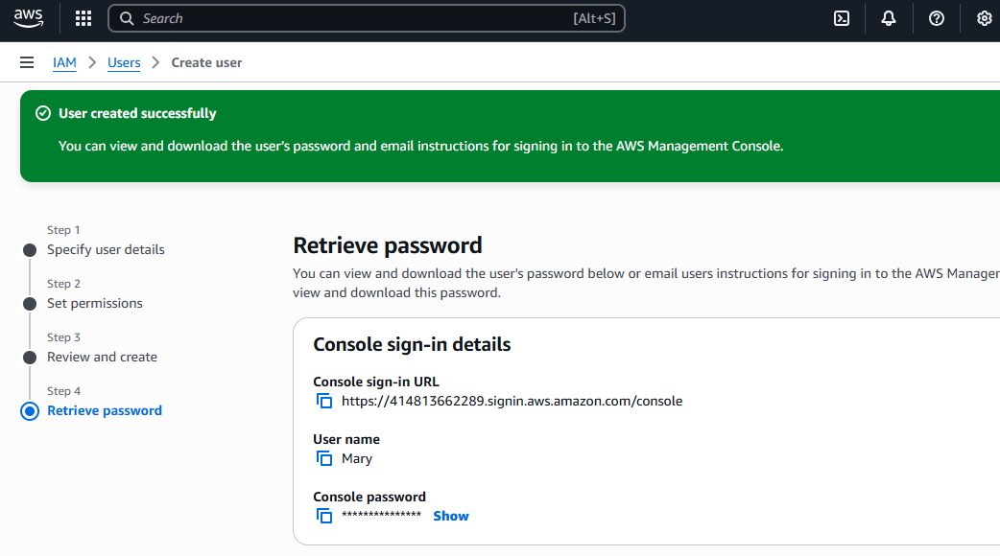
## Login-in as john
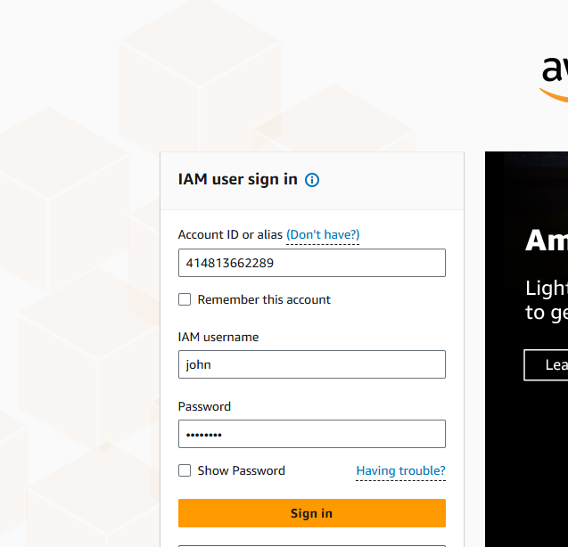
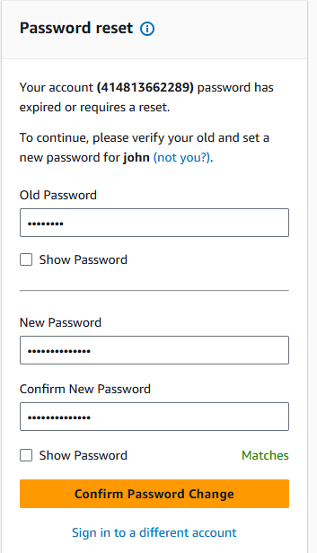
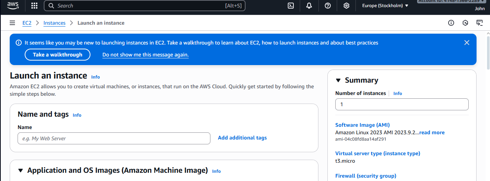
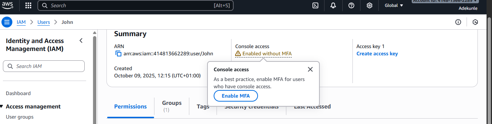
## Login-in as Mary
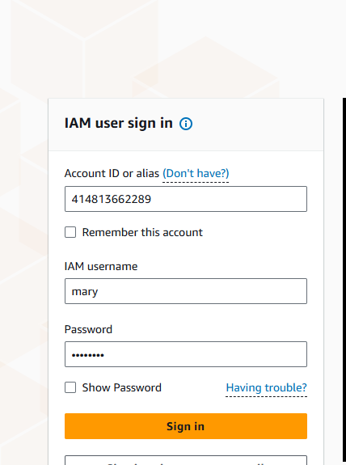
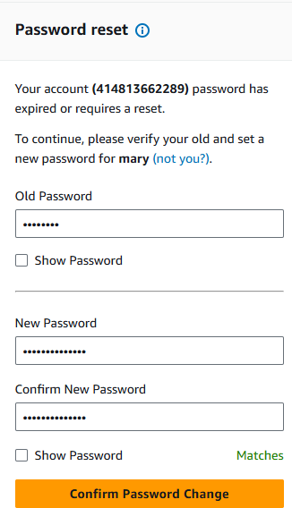
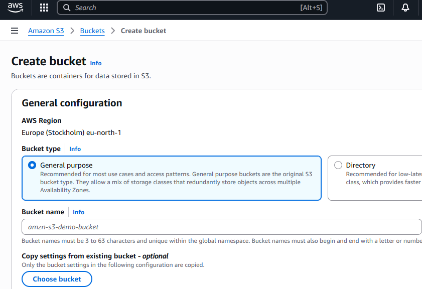
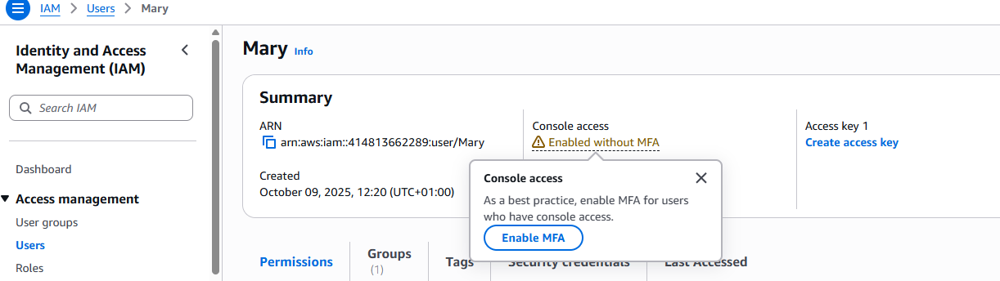

## Role of IAM in AWS
Role of IAM in AWS
IAM (Identity and Access Management) in AWS is a fundamental service that enables you to securely control access to AWS resources. It allows you to manage who (identity) can do what (access) on which resources, under what conditions
Purpose of IAM in AWS
1.	Authentication
IAM ensures only authorized users or systems can access your AWS environment by providing credentials (like usernames, passwords, access keys, roles, etc.).
2.	Authorization
IAM controls what actions users or systems can perform (e.g., read data, start instances, delete resources) using policies that define permissions.
3.	Granular Access Control
IAM enables fine-grained permissions so you can grant the least privilege — only the minimum access needed to perform a task.
4.	Centralized Management
IAM allows you to centrally manage access for all users, roles, and permissions in your AWS account, improving organization and efficiency.
How IAM Contributes to Security
1.	Enforces Least Privilege
Users and systems only get access to resources they absolutely need, reducing the risk of accidental or malicious actions.
2.	Multi-Factor Authentication (MFA)
Adds an extra layer of security to user accounts by requiring a second factor (like a code from a mobile device).
3.	Temporary Credentials
IAM roles can grant temporary, limited-access credentials, reducing the risk of long-term credential exposure.
4.	Auditability
IAM actions are logged in AWS CloudTrail, helping track who accessed what and when — important for compliance and incident response.
How IAM Supports Efficient Cloud Management
1.	Role-Based Access Control (RBAC)
Assign permissions to roles instead of individual users. For example, a "Developer" role might have access to EC2 and Lambda, while an "Auditor" role has read-only access to logs.
2.	Federation
Integrate with corporate directories (like Active Directory) to manage user identities and permissions centrally, without creating separate AWS accounts for every user.
3.	Policy Management
Use JSON-based IAM policies to easily assign, update, or remove permissions across users, groups, and services.
4.	Scalability
IAM scales automatically as your organization grows — you can manage thousands of users and policies with the same service.

## Difference Between IAM Users and Groups in AWS
In AWS Identity and Access Management (IAM), both users and groups are used to manage access to resources, but they serve different purposes.
IAM Users: An IAM user is an individual identity with its own set of credentials (username, password, access keys) used to interact with AWS.
Key Characteristics:
•	Represents a single person or service.
•	Has unique credentials (login and programmatic).
•	Permissions can be directly attached to the user.
•	Useful for individual access and fine-grained control.
Example Use Case:
You hire a DevOps engineer who needs access to AWS to manage EC2 instances and deploy code.
You create an IAM user with a specific policy allowing EC2 and CodeDeploy access.
IAM Groups
Definition:
An IAM group is a collection of IAM users. It allows you to manage permissions for multiple users at once.
Key Characteristics:
•	Cannot log in — it's not an identity itself.
•	Users inherit all permissions assigned to the group.
•	Simplifies bulk permission management.
•	Users can belong to multiple groups.
Example Use Case:
You have 10 developers who all need similar access to Lambda and S3.
You create a group called "Developers", attach a policy to the group, and add the users to it. Now all users automatically get the required permissions.
IAM Users vs IAM Groups
Feature	IAM User	IAM Group
Identity Type	Individual (person or service)	Collection of users (no login capability)
Has Credentials	Yes (password, access keys)	No
Direct Login	Yes	No
Permissions Assignment	Direct or via group	Only via policies attached to the group
Use Case	Unique, individual access	Manage permissions for multiple users
Scalability	Limited (manual per-user management)	High (bulk permission changes via group)
Example	Admin user, DevOps engineer	Developers group, Auditors group
## Creating IAM Policies in AWS: Step-by-Step Guide
An IAM policy in AWS defines permissions that determine what actions are allowed (or denied), on which resources, and under what conditions.
Step 1: Go to the IAM Console
1.	Sign in to the AWS Management Console.
2.	Navigate to IAM service.
3.	In the sidebar, click "Policies".
4.	Click "Create policy".
Step 3: Create the Policy
You have two options:
🔹 Option A: Use the Visual Editor
•	Choose a Service (e.g., S3).
•	Select Actions (e.g., GetObject for read access).
•	Define Resources (e.g., a specific S3 bucket ARN).
•	(Optional) Add Conditions (e.g., only from a specific IP).
Step 4: Review and Create Policy
1.	Click Next: Tags (optional).
2.	Add tags if needed (for tracking or automation).
3.	Click Next: Review.
4.	Give your policy a Name (e.g., S3ReadOnly-ExampleBucket).
5.	Add a description (optional but recommended).
6.	Click Create policy.
Step 5: Attach the Policy
Now that your policy is created, attach it to the appropriate user, group, or role.
🔹 Attach to a User:
•	Go to IAM > Users.
•	Select the user.
•	Go to the Permissions tab.
•	Click "Add permissions" → Attach existing policies directly.
•	Find your custom policy and check the box.
•	Click Next, then Add permissions.
🔹 Attach to a Group:
•	Go to IAM > Groups.
•	Select the group.
•	Click "Attach Policy".
•	Select your custom policy and confirm.
🔹 Attach to a Role:
•	Go to IAM > Roles.
•	Select the role.
•	Click "Attach policies".
•	Choose your custom policy and save
