# Advance linux commands

## ls latr command
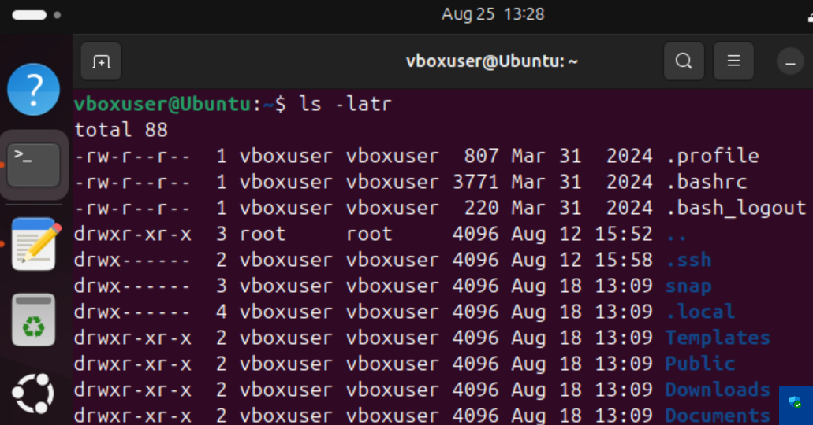

## Creating and checking the permission of script file
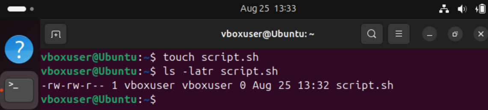

## Chown command and chmod command
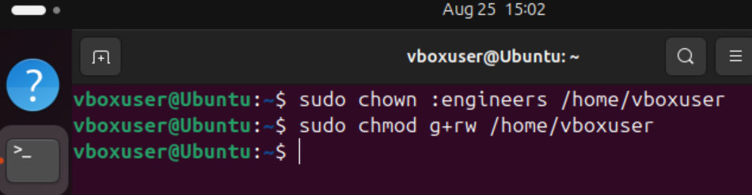

## Creating a user johndoe
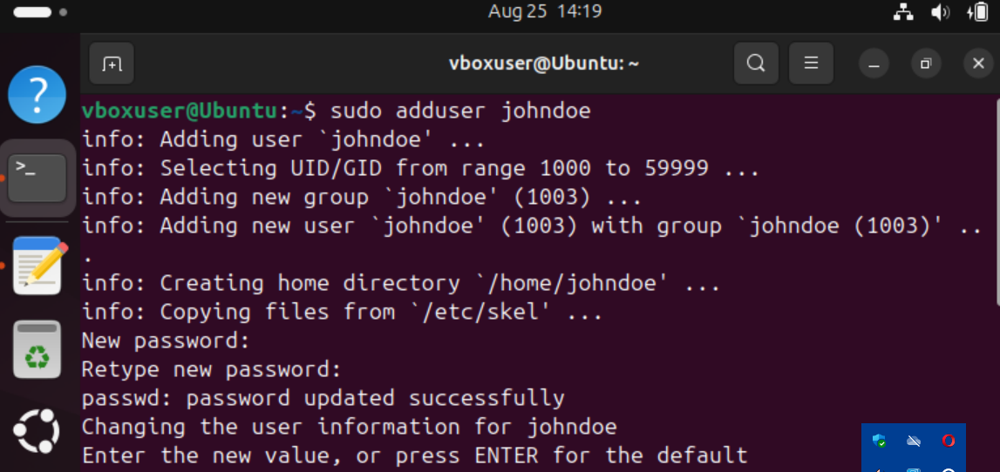
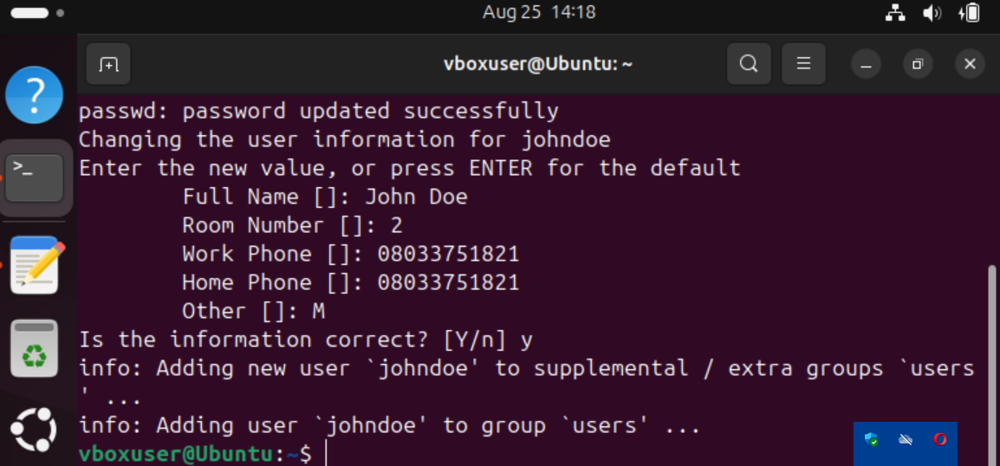

## Switching to johndoe
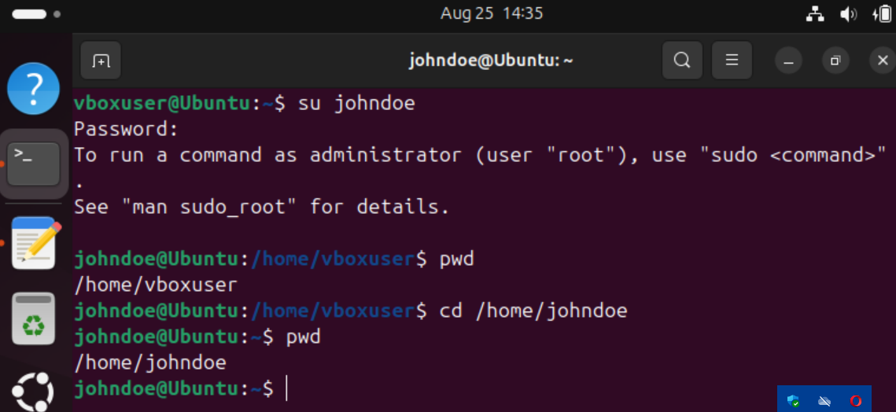

## Changing password
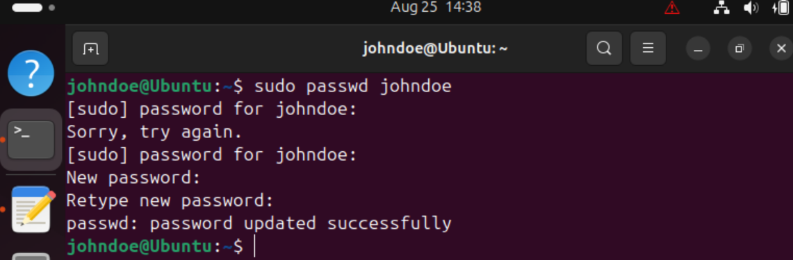

## Loging in with the new password
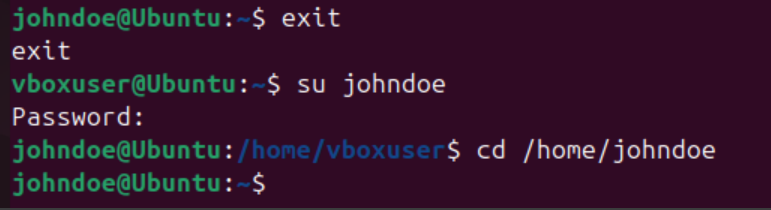

## Creating engineers group
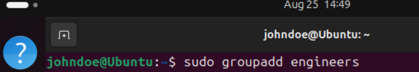

## Adding johndoe to a group
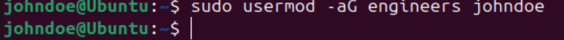

## Verifying johndoe group

## Deleting a user
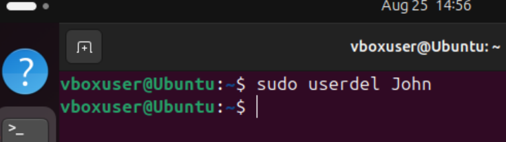

## Creating a devops group
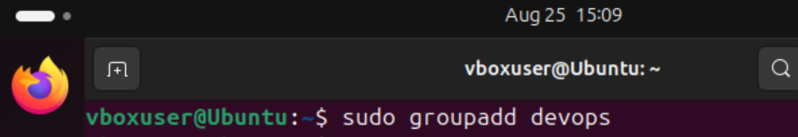

## Verifying devops group created
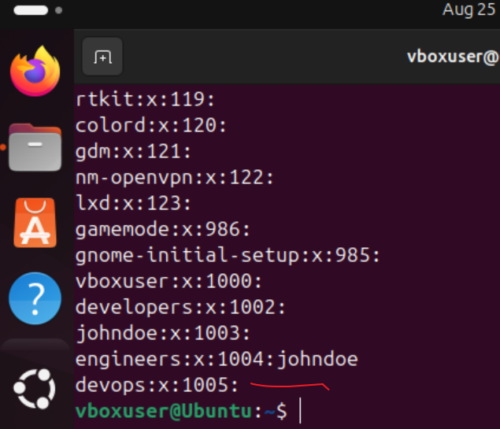

## Creating users
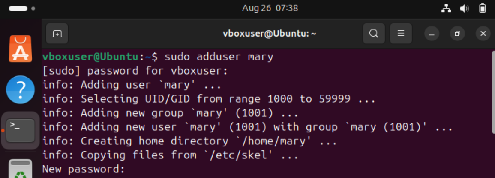
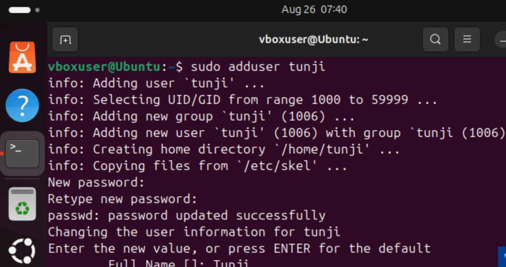
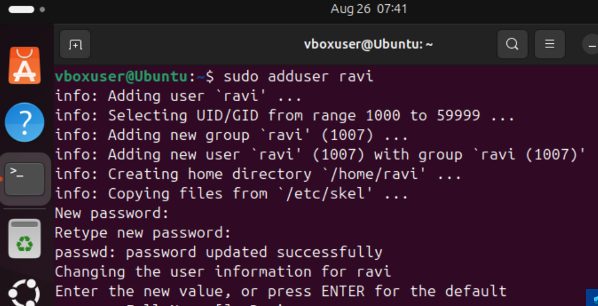
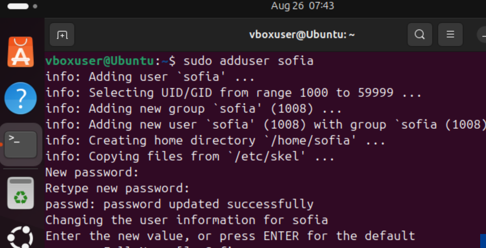
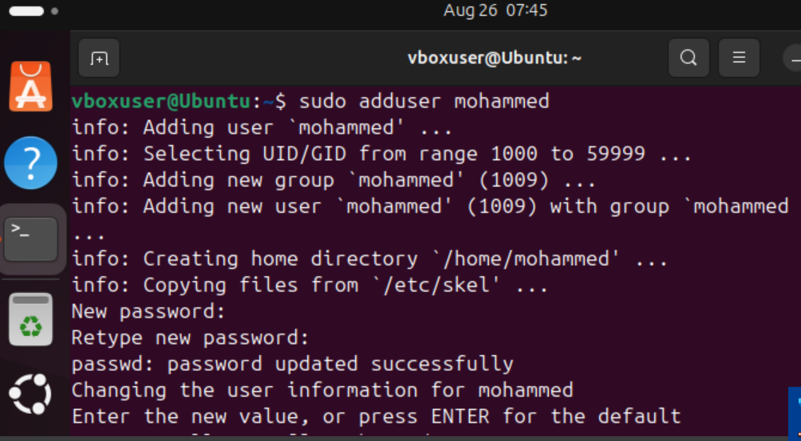

## Users home directory and folder created
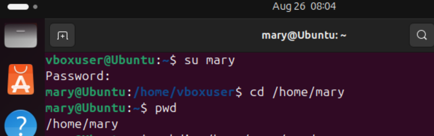
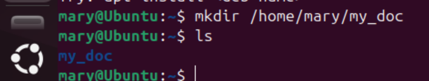
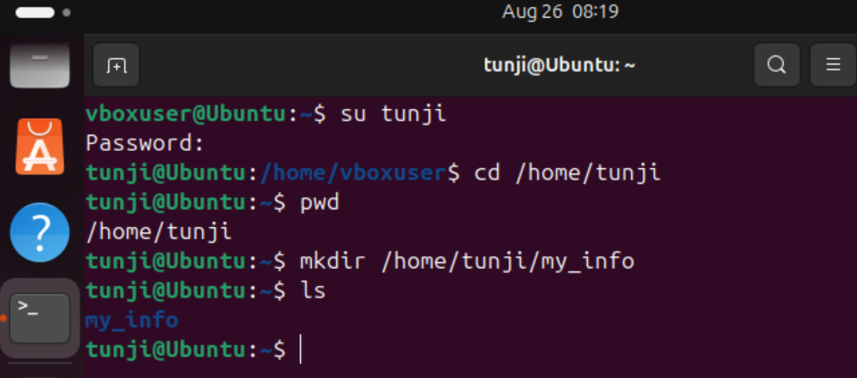
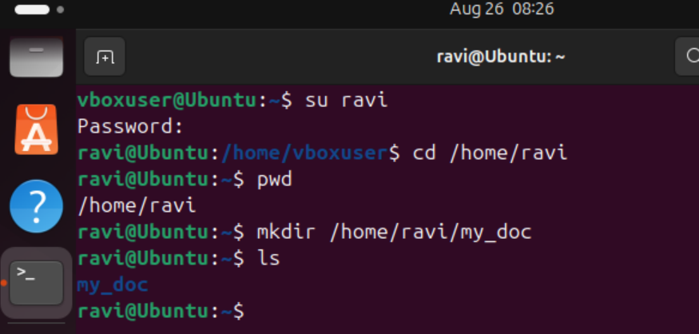
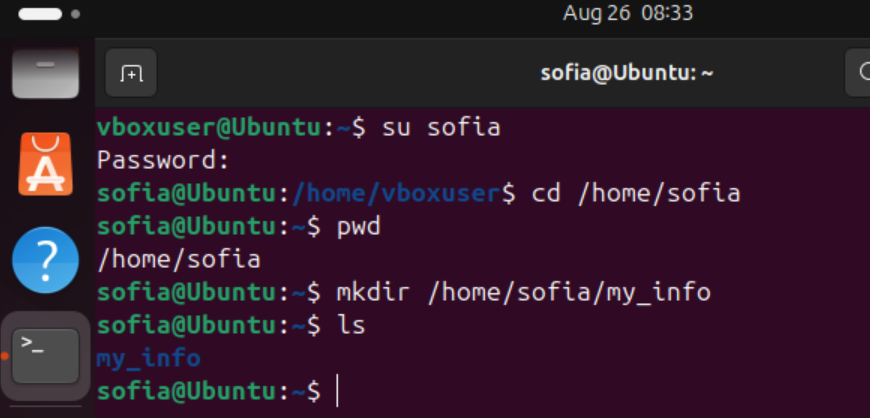
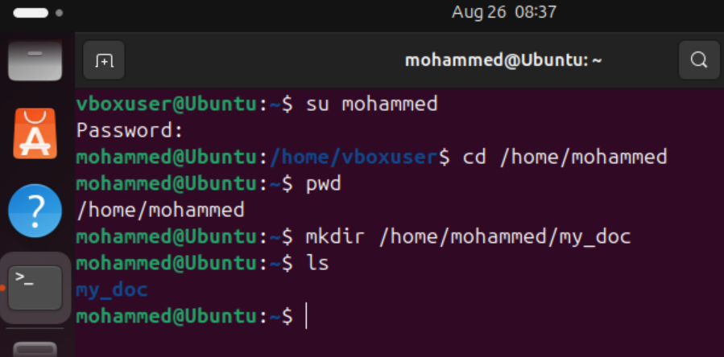

## Verifying the users group
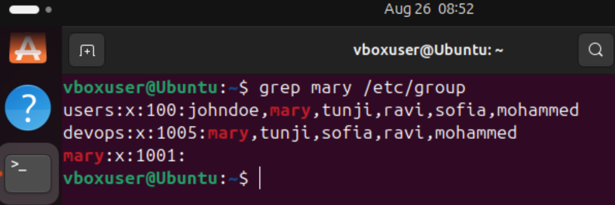

## Verifying the ownership of the folder created for the users
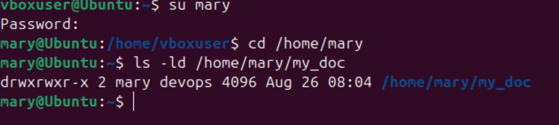
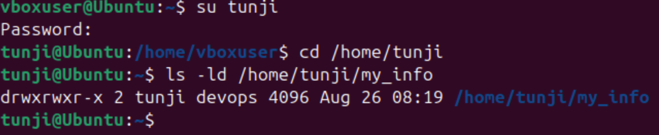
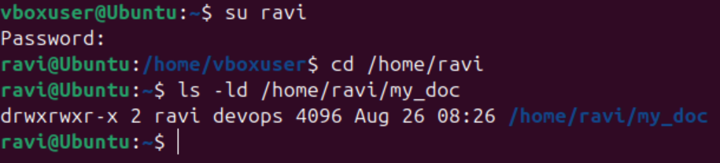
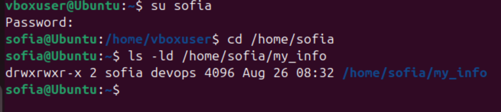
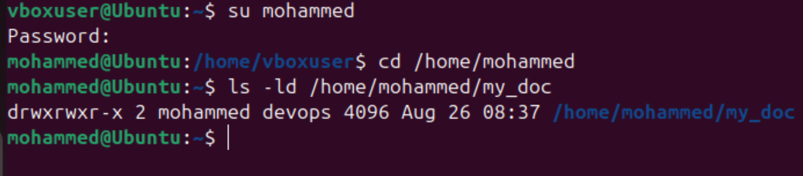