# Control flow in shell scripting

## Creating new file, writting script and executing
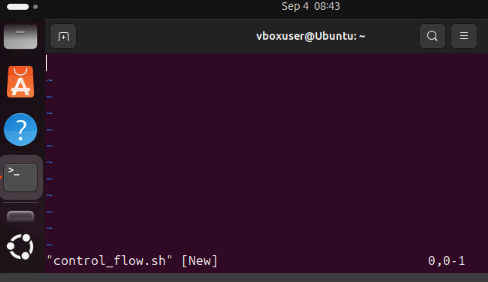
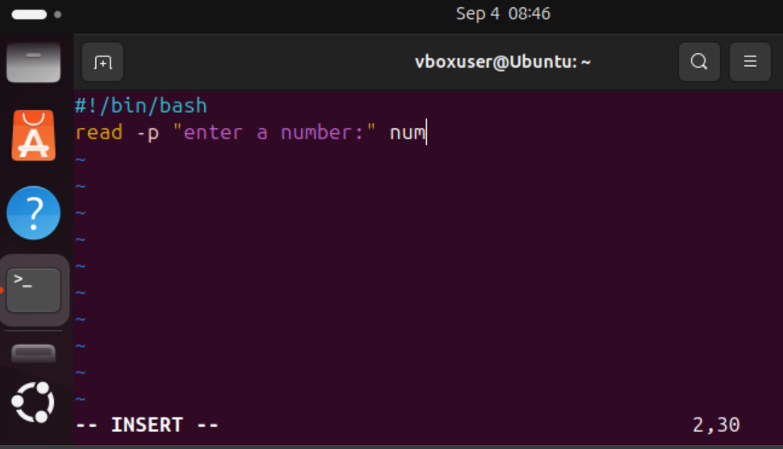
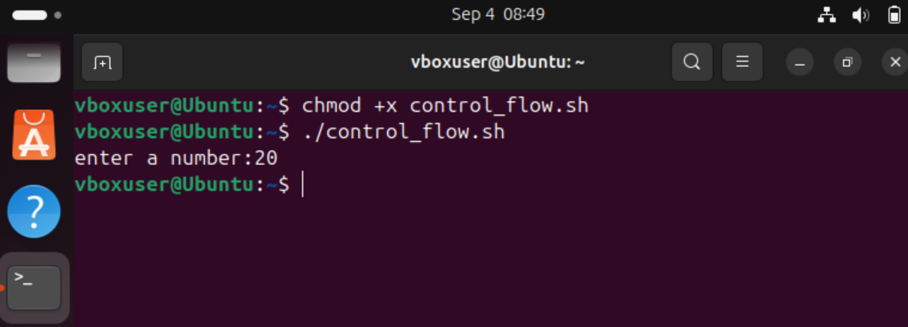

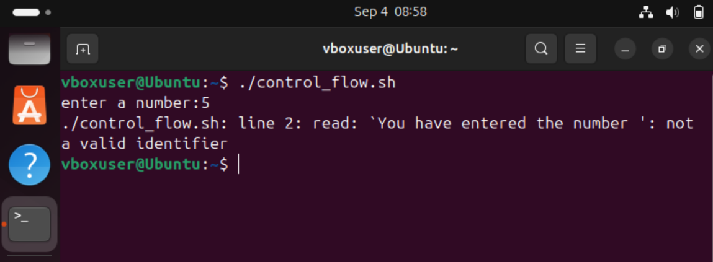

## If statement
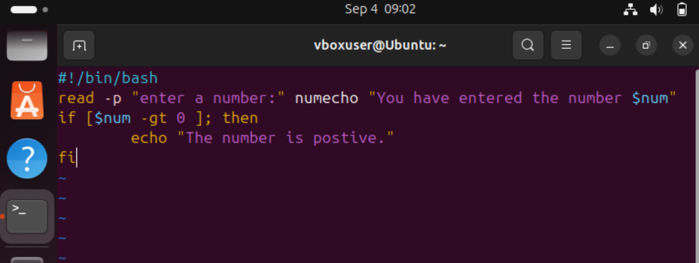
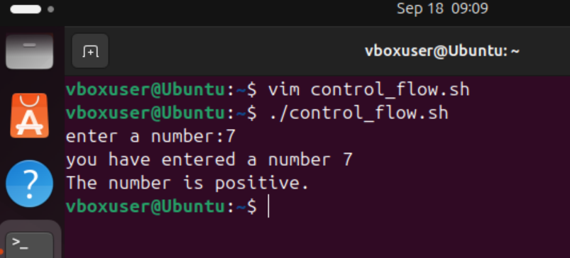

## if and elif statement

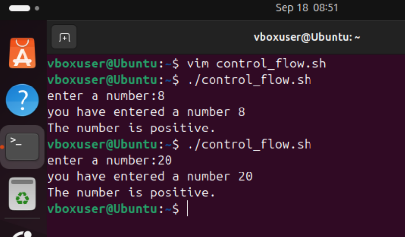

## Loop examples
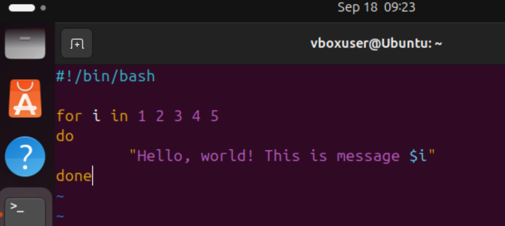
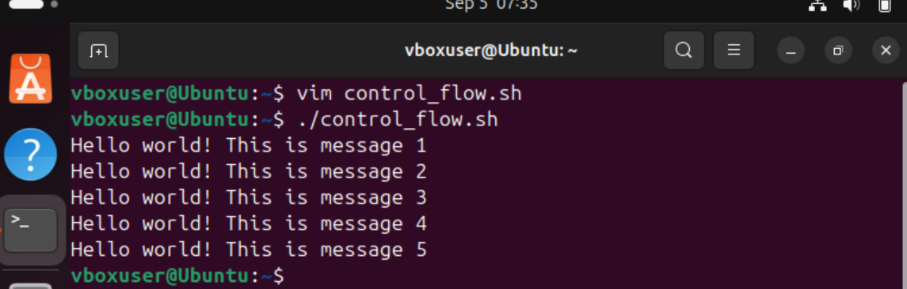
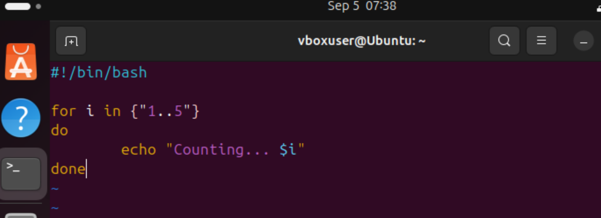
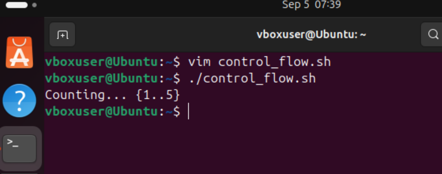

## Task example 1

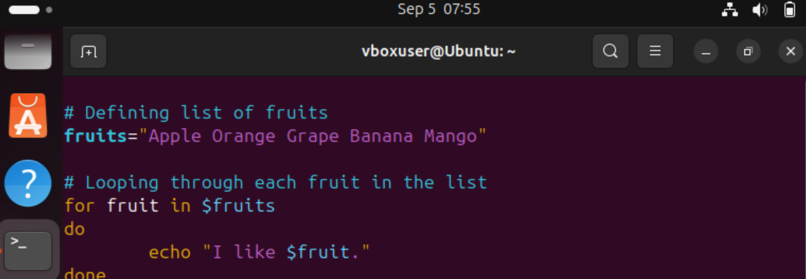
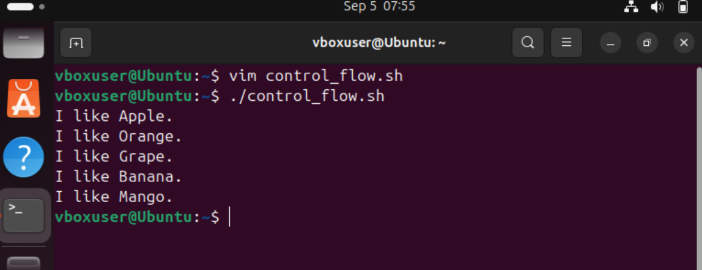

## Task example 2
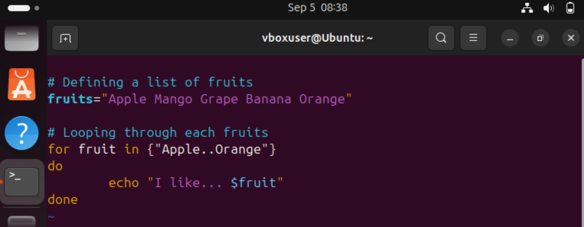
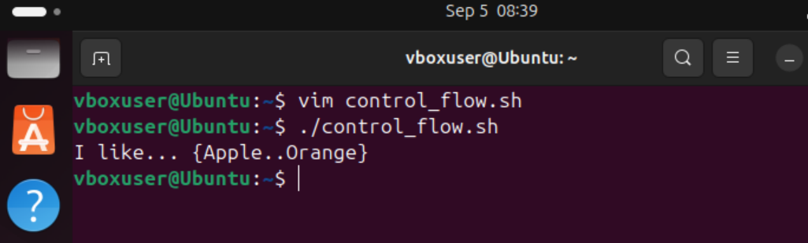
