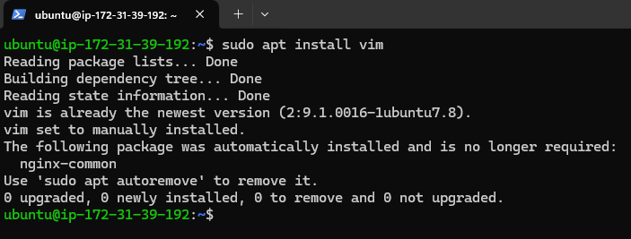
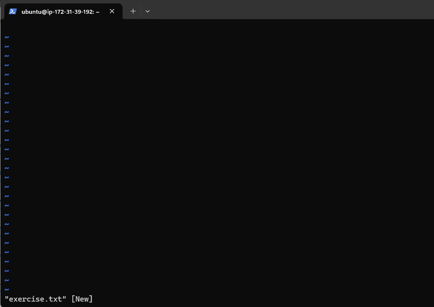
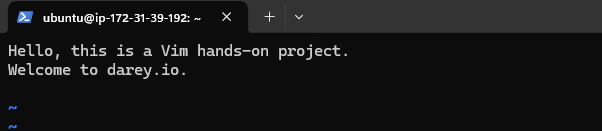
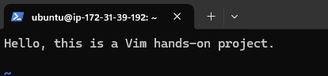
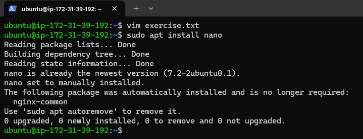
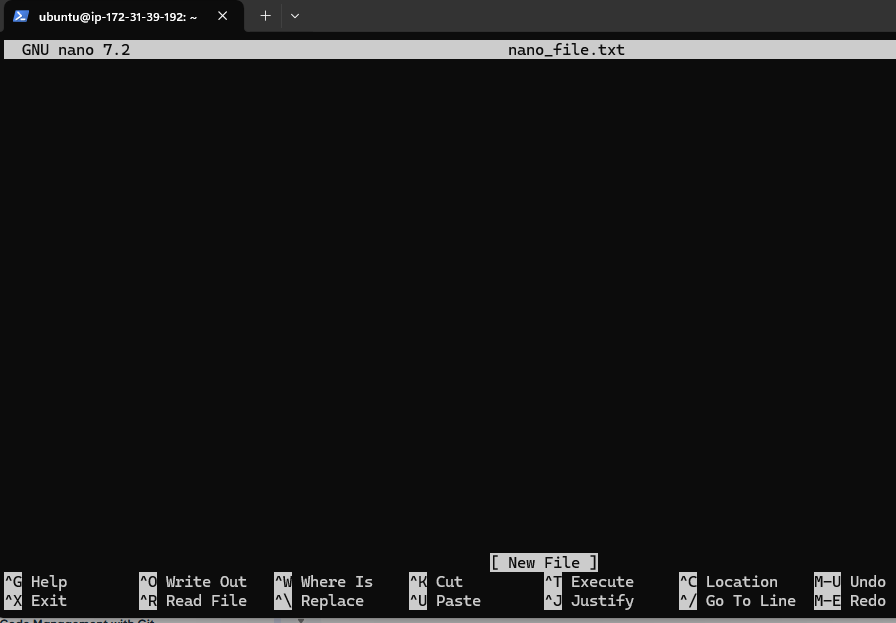
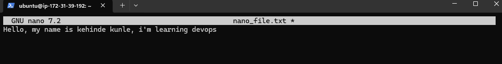
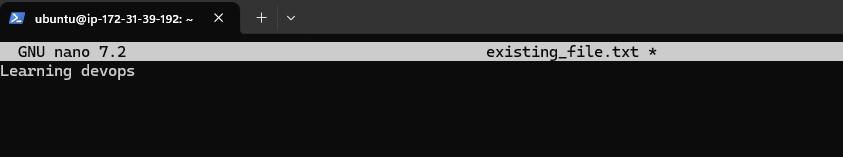

# Linux Text Editor

## Installing vim

## Opening Vim Exercise txt

## Insert Mode

## Deleting a Character

## Deleting entire line

## Installing Nano

## Nano text environment

## Typing on nano interface

## Nano existing file
