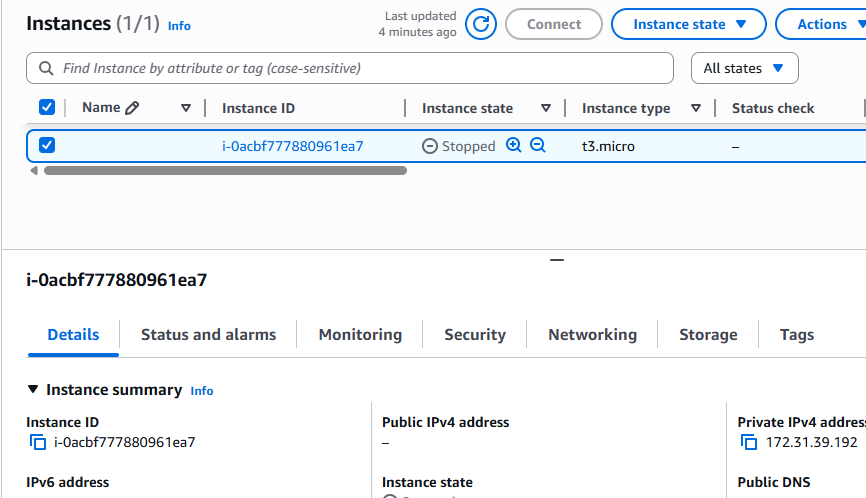
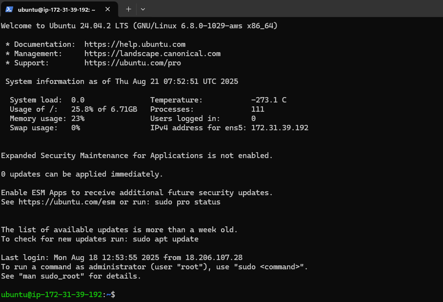
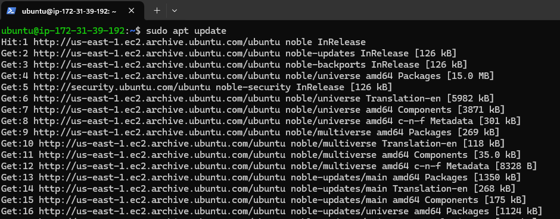
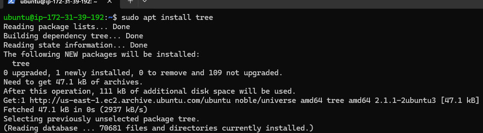
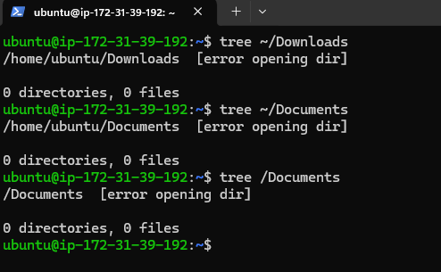
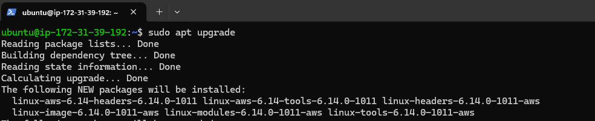
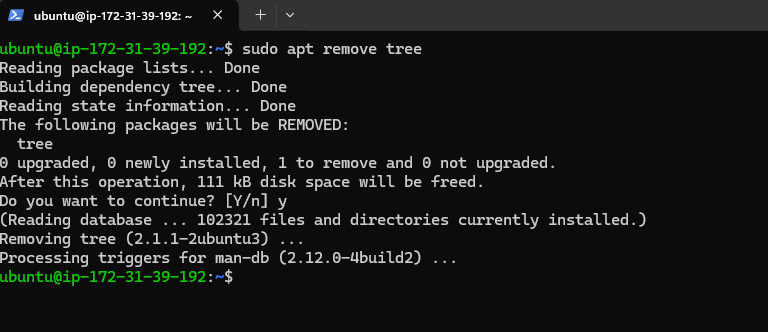
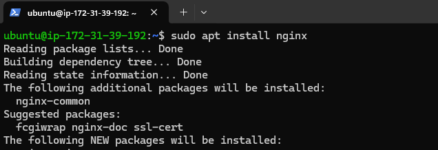
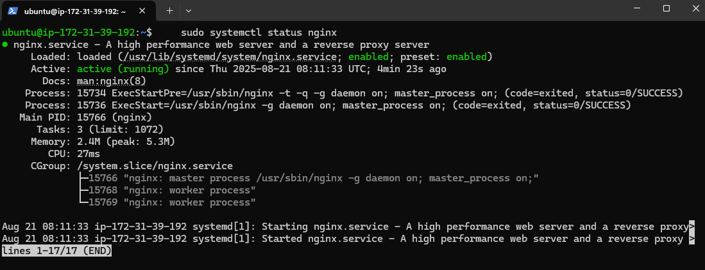
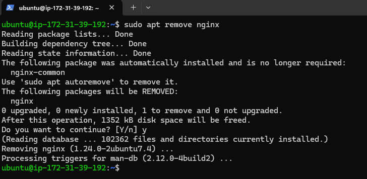

# Linux Fundamentals Mini Project

## Ec2 Instance 

## Connecting to my Ec2

## Sudo apt update

## Installing, Veryfying, Upgrading, and Removing tree software

## Installing, Veryfying, and Removing nginx software

