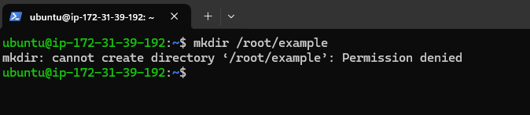
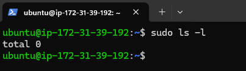
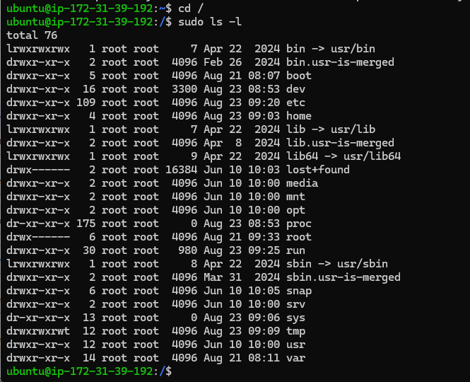
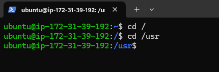
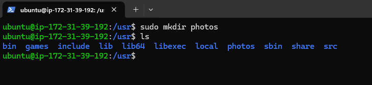
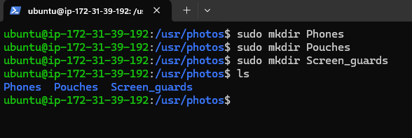
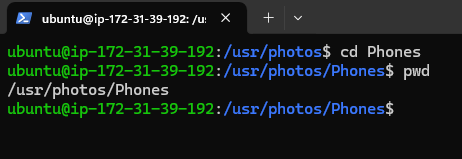
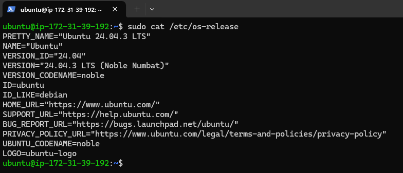

# Basics Linux Commands

## Creating a directory to get an error

# Sudo ls -l command

# Root directory and the sudo ls -l command

# Usr directory

# Creating a photo directory inside usr directory

# Navigating into phots directory

# Creating 3 directories radonmly into photos directory

# Newly created directories 

# Navigating into one of the new directory

# The full pathway

# Cat command
