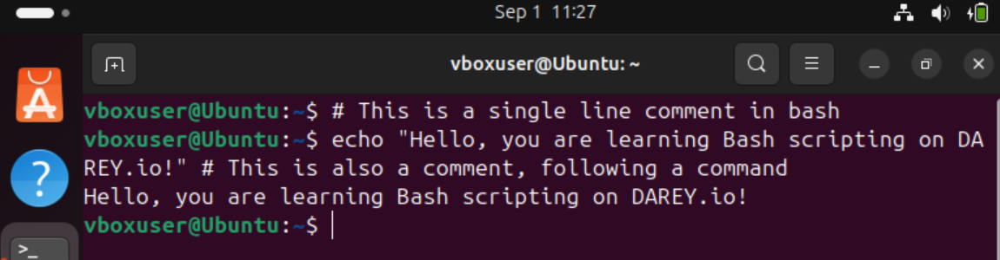
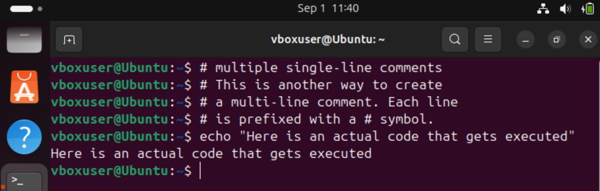
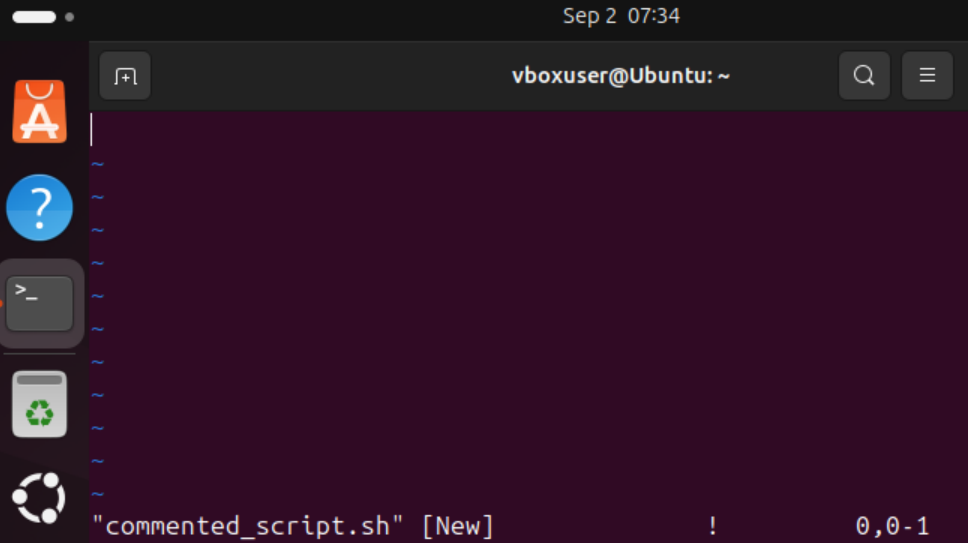
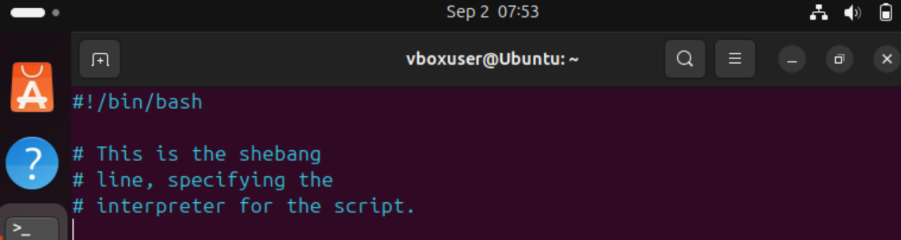
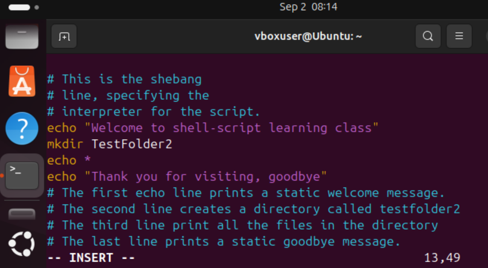
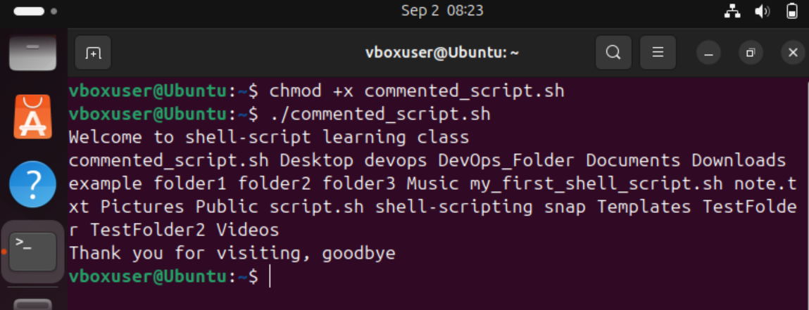

# Adding comments in bash scipt

## Single line comment

## Multiple line comment

## Creating a shell script

## Multi line comment

## Writting script

## Saving, giving execute permission and executing the shell script

