# Shell script mini project

## Creating a folder
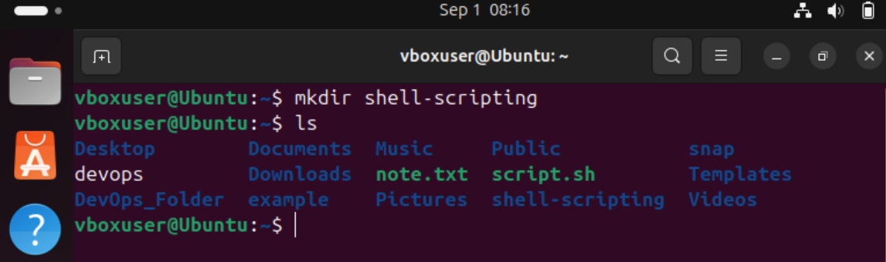

## Installing vim
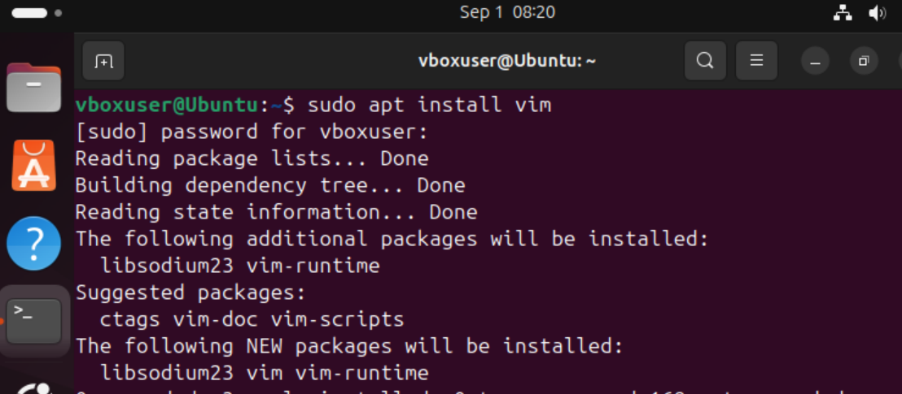

## Creating a file with vim editor
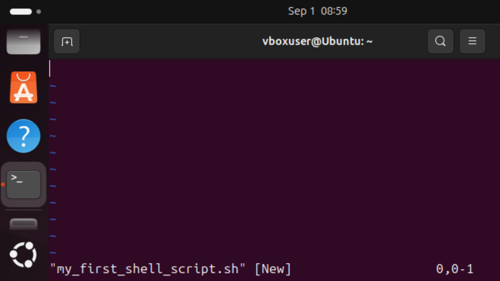

## Inserting into the new file
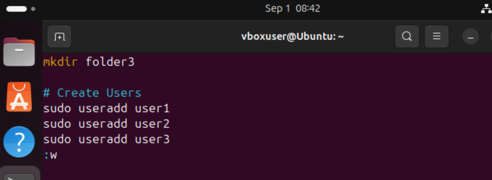

## Changing directory
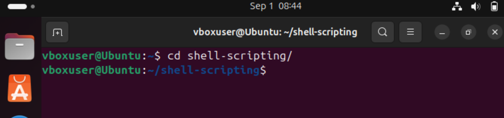

## ls -latr command
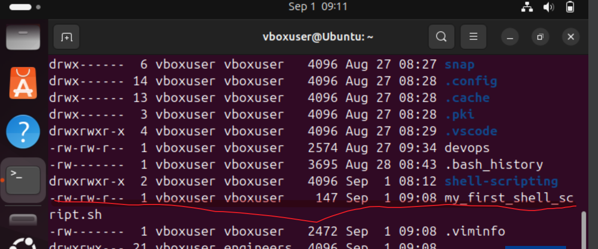

## Running the shell script and getting denied message
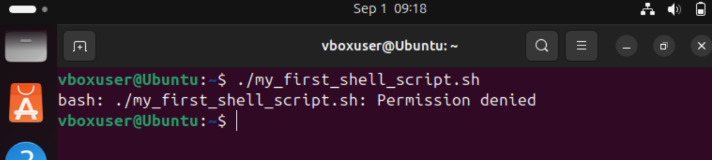

## Adding the execute permission
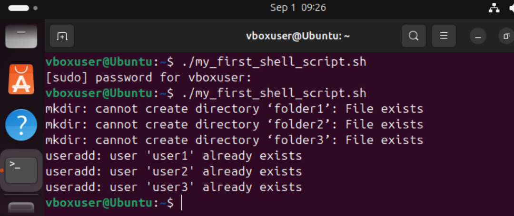

## Verifying the folders and users
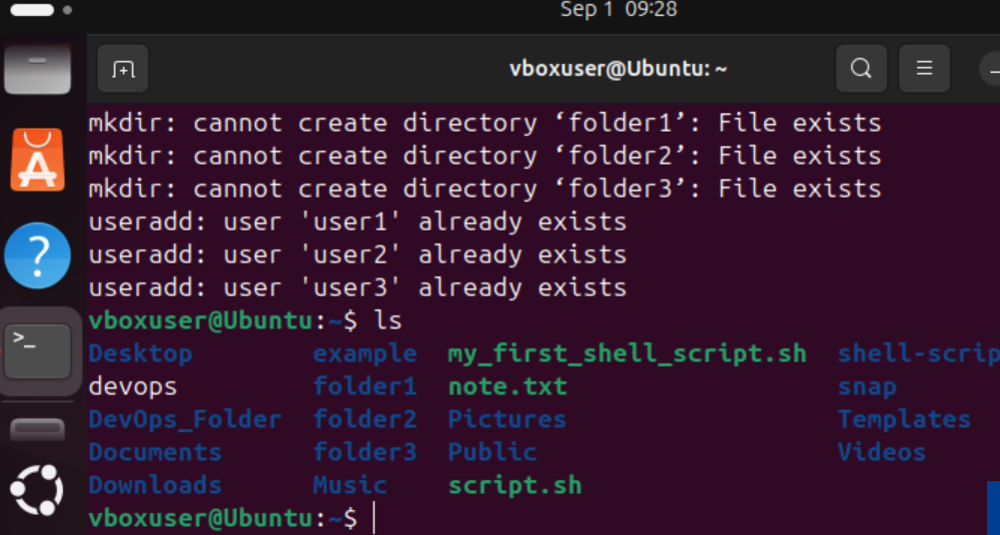

## Testing shell script
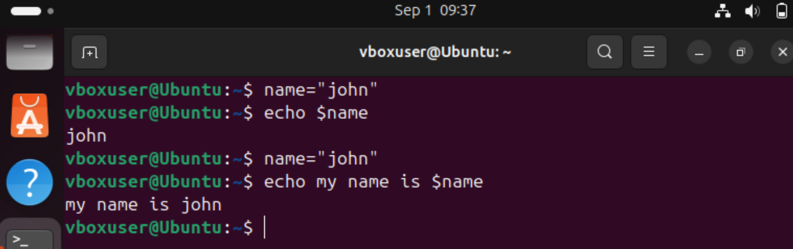

# Adding comments in bash scipt

## Single line comment
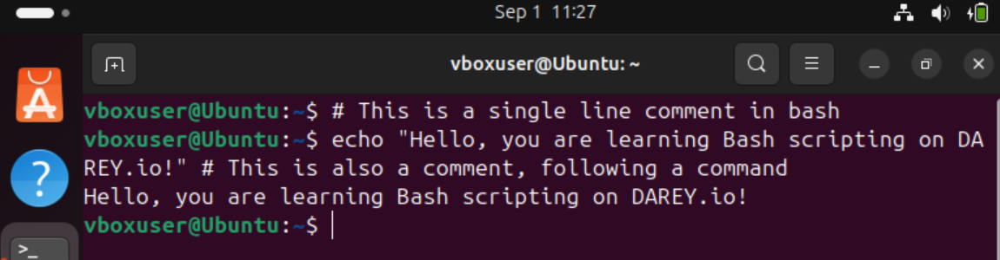

## Multiple line comment
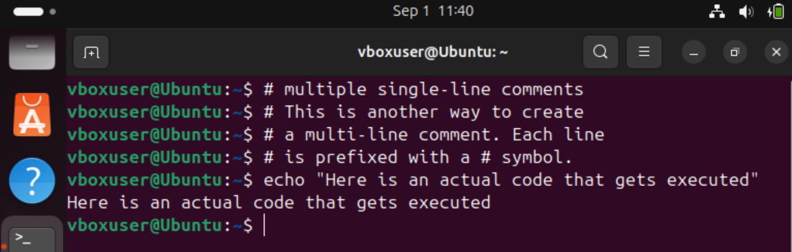

