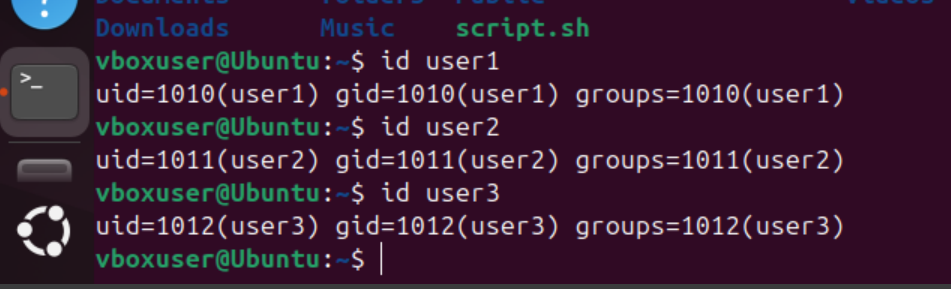

# Shell script mini project

## Creating a folder

## Installing vim

## Creating a file with vim editor

## Inserting into the new file

## Changing directory

## ls -latr command

## Running the shell script and getting denied message

## Adding the execute permission

## Verifying the folders and users

## Testing shell script

# Adding comments in bash scipt

## Single line comment

## Multiple line comment

