# Working with functions

## summerizing into a paragraph
In this mini project, I learned how to organize a shell script by encapsulating logic into reusable functions to enhance readability, modularity, and maintainability—an essential skill in professional scripting. I started by refactoring code to include a function check_num_of_args to validate input arguments and moved on to isolating logic for handling environment-specific configurations using activate_infra_environment. I then created a check_aws_cli function to verify the presence of the AWS CLI, ensuring that required tools are installed before proceeding. Finally, I implemented check_aws_profile to confirm that the appropriate AWS authentication is in place via environment variables. Through this structured approach, I now understand the importance of function definition, function invocation, and how to handle conditions like argument validation, dependency checks, and environment-specific setups, all of which are foundational for writing scalable and professional-grade automation scripts.

## Checking if script has an argument
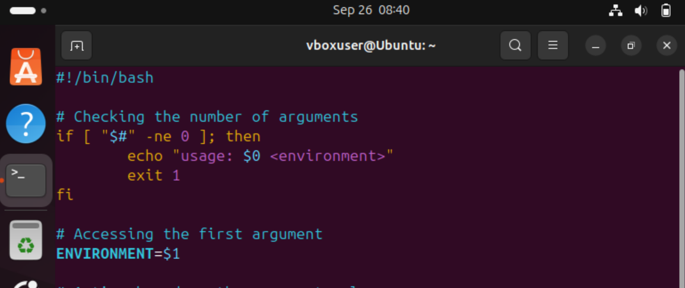 
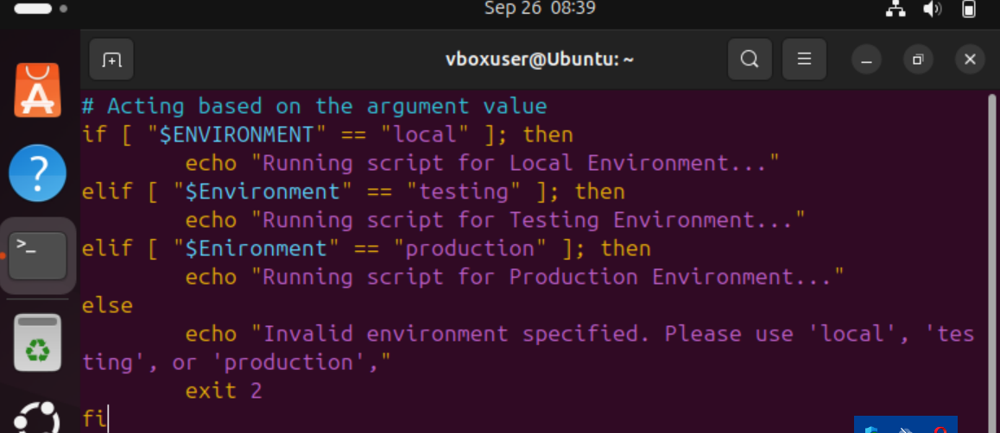
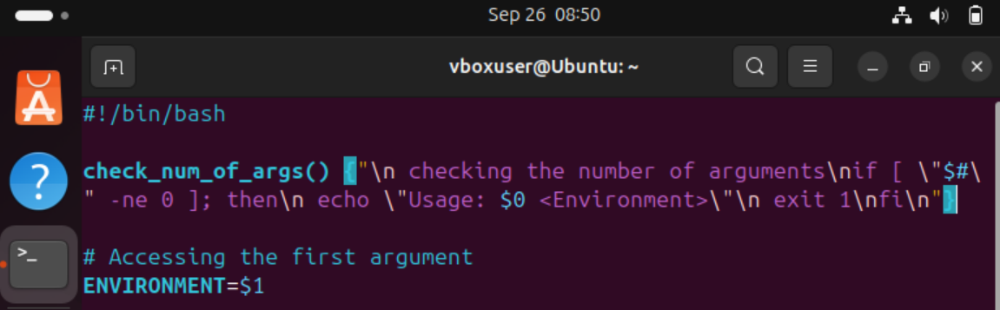
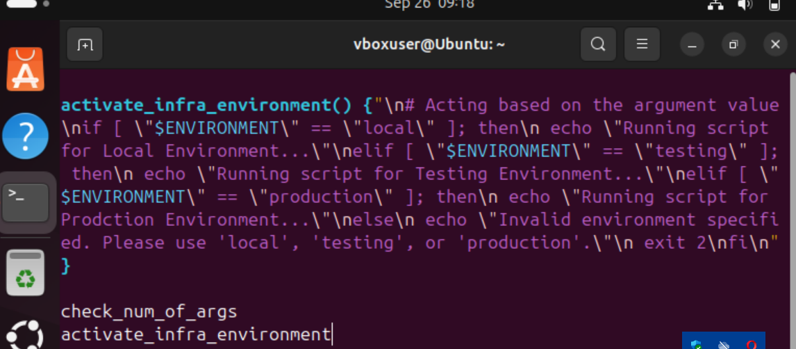
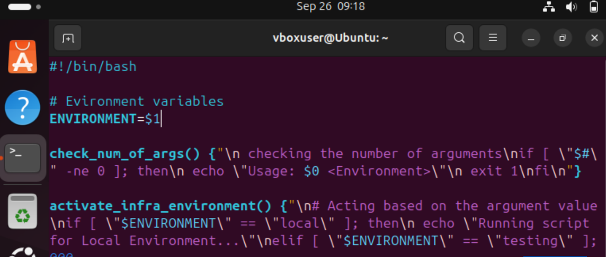
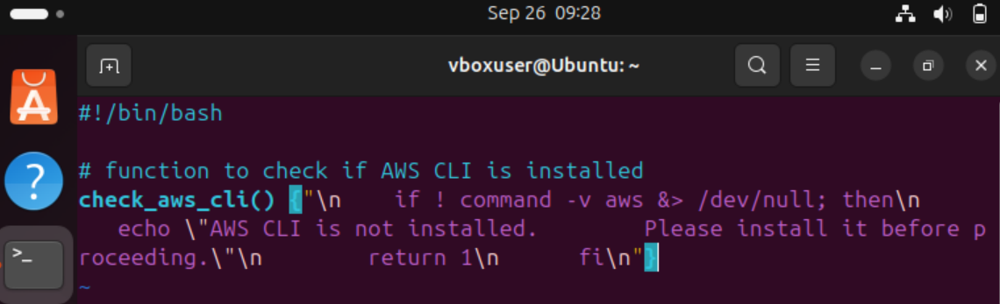
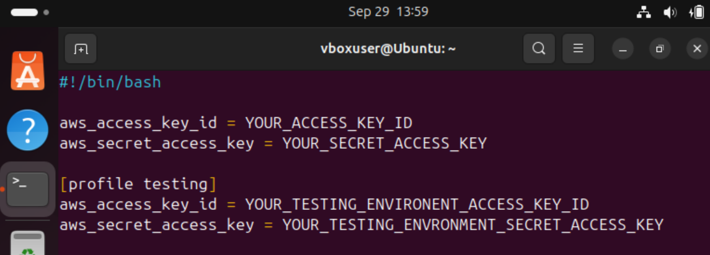
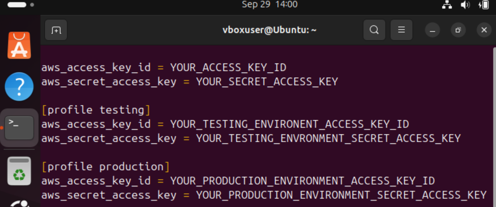
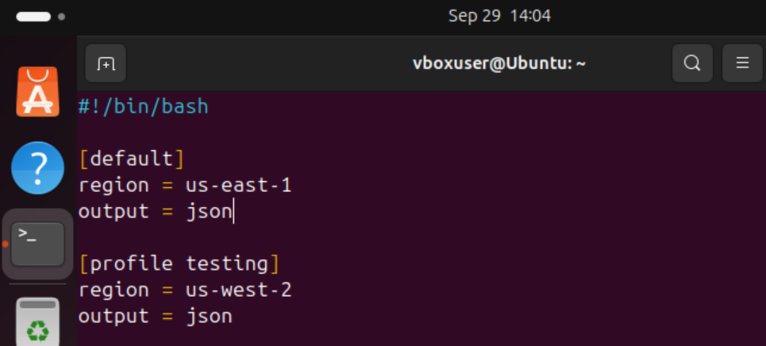
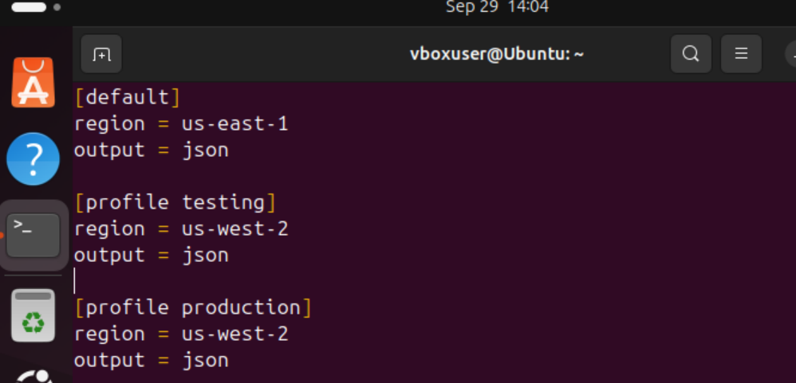
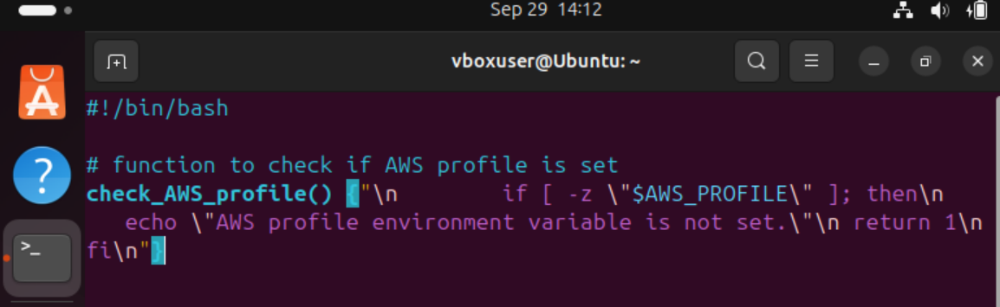
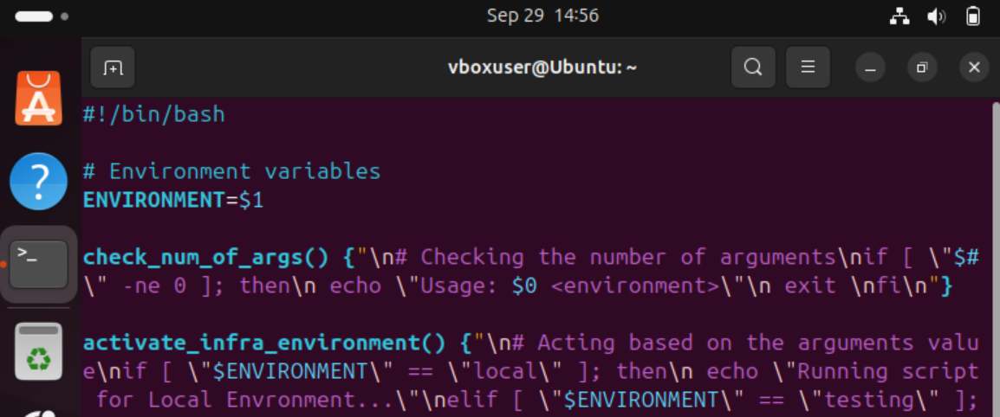
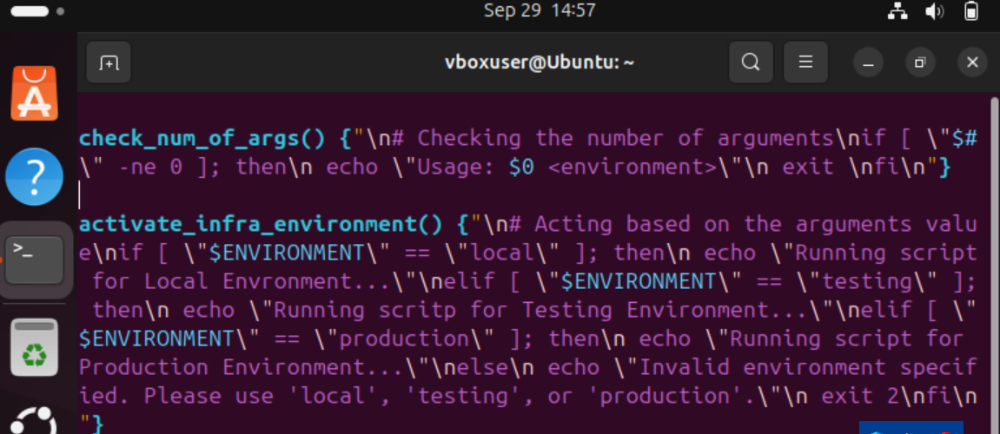
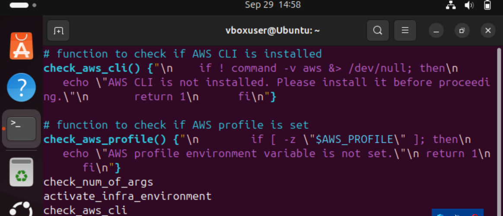